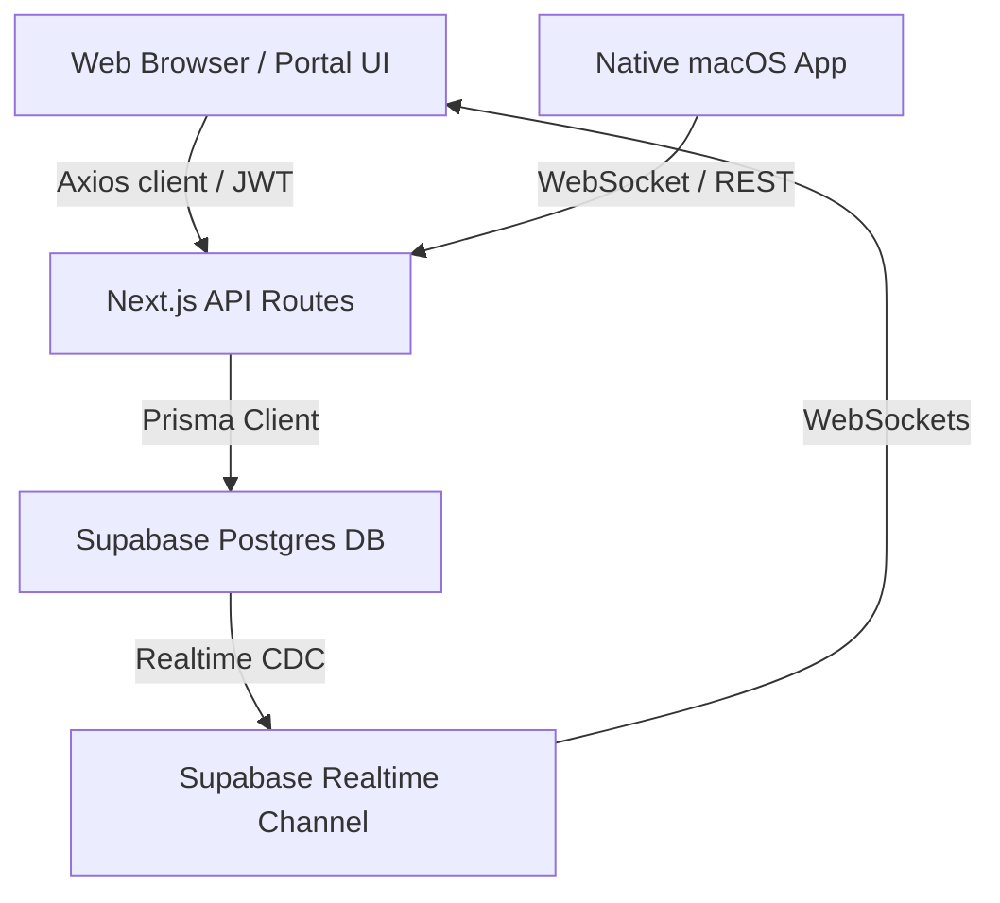

# Notch Web Portal - Design Specification

This document defines the UI/UX design system, page architecture, and technical implementation specifications for the **Notch Web Portal**, which serves as the cloud backend, account management dashboard, and real-time focus ranking service for the Notch macOS application.

---

## 1. Product Identity & Design Philosophy

The Notch Web Portal is designed to feel cohesive with a premium, modern macOS desktop utility. It leverages deep dark themes, subtle grid aesthetics, and frosted glass overlays (glassmorphic design) to deliver a state-of-the-art developer and user experience.

### Key Pillars
- **Dark Mode First**: Clean black backgrounds (`#000000`) combined with dark charcoal containers (`#0b0b0f` / `rgba(255, 255, 255, 0.03)`) to make content pop and reduce eye strain.
- **Glassmorphic Boundaries**: Use of high background blur (`backdrop-filter: blur(20px)`), translucent border lines (`rgba(255, 255, 255, 0.1)`), and inner shadows to simulate depth.
- **Micro-Animations**: Fluid transitions on interactive elements (`cubic-bezier(0.16, 1, 0.3, 1)`) and soft-glowing accents to make the portal feel responsive and alive.
- **Minimal Grid Pattern**: A subtle background dot-grid pattern (`radial-gradient`) to give texture to large empty spaces.

---

## 2. Design Tokens (CSS Variables)

Defined in [globals.css](file:///Users/promex04/Documents/NO/notch-app/portal/src/app/globals.css) inside `:root` to ensure global style consistency:

```css
:root {
  /* Color System */
  --background: #000000;
  --foreground: #ffffff;
  --muted: #a1a1aa;
  --muted-strong: #d4d4d8;
  --border: rgba(255, 255, 255, 0.1);
  --border-strong: rgba(255, 255, 255, 0.2);
  --card: rgba(255, 255, 255, 0.03);
  --card-strong: rgba(255, 255, 255, 0.05);

  /* Accents & Highlights */
  --accent: #38bdf8;          /* Sky Blue */
  --accent-strong: #0284c7;
  --accent-soft: rgba(56, 189, 248, 0.1);
  --accent-gradient: linear-gradient(135deg, #38bdf8 0%, #818cf8 100%);
  --warm: #f97316;            /* VNPAY & Pro highlights */
  --green: #10b981;           /* Trusted items, success status */
  --red: #ef4444;             /* Errors, destructive actions */

  /* Borders & Radius */
  --radius-full: 9999px;
  --radius-2xl: 48px;
  --radius-xl: 32px;
  --radius-lg: 20px;
  --radius-md: 12px;
  --radius-sm: 8px;
}
```

---

## 3. Core Interface Components

### 3.1. Unified Navigation Bar (`<Navbar />`)
- **Location**: [Navbar.tsx](file:///Users/promex04/Documents/NO/notch-app/portal/src/components/portal/Navbar.tsx)
- **Visual Behavior**: 
  - Centered floating layout with a translucent glass background.
  - Automatically shifts layout and colors when scrolled (expanding from transparent to frosted black).
  - Highlights active routes based on the current window pathname.
  - Contains responsive mobile hamburger drawer that handles clean sliding transitions.
- **Session Indicators**: 
  - Authenticated: Renders account navigation pill with the user's **Google Avatar image** (if present) and the text "Tài khoản".
  - Guest: Displays a prominent white "Đăng nhập" button.

### 3.2. Account Dashboard (`/account`)
- **Location**: [ProfileView.tsx](file:///Users/promex04/Documents/NO/notch-app/portal/src/components/portal/ProfileView.tsx)
- **Features**:
  - Displays user profile summaries, email addresses, and subscription plan badges (e.g., "Gói Pro" vs "Gói Miễn phí").
  - Houses the **Upgrade Pro** (VNPAY Checkout API wrapper) action and **Log Out** button directly in the hero section.
  - Includes a device management table that shows active hardware, platform, last seen timestamps, and trust/revoke configuration buttons.
  - Implements the browser back-button cache recovery (`bfcache` reset) on `pageshow` to guarantee plan status updates upon payment completion.

### 3.3. Real-Time Leaderboard (`/leaderboard`)
- **Location**: [RealtimeLeaderboard.tsx](file:///Users/promex04/Documents/NO/notch-app/portal/src/components/portal/RealtimeLeaderboard.tsx)
- **Visuals**:
  - Renders user focus ranking lists.
  - Uses reactive HSL gradients for top-ranking badges (Gold, Silver, Bronze highlights).
  - Uses Supabase Realtime client (`@supabase/supabase-js`) to subscribe to realtime inserts on the `FocusDailyStat` table, immediately animating ranking changes in the UI.

### 3.4. Login & App Authorization Pages
- **Location**: `/login` & `/oauth/authorize`
- **Theme**: Minimal, centered login card with Google OAuth integration.
- **OAuth Authorize**: 
  - Matches `/login` layout precisely (floating navbar, header spacing, glassmorphic card).
  - Implements a fullscreen success state (`PortalSuccessEffect.tsx`) featuring check-ring drawing animations and animated ambient background color blobs (`blobFloat`).

---

## 4. Administrative Console (`/admin`)

The Administrative panel retains a clean, structured light layout to prioritize clarity and density for auditing database metrics.

### Key Screens
- **Dashboard**: High-level statistical charts summarizing daily active users, focus hours, and application event metrics.
- **Capabilities Manager** (`/admin/capabilities`): Allows toggling feature flags (e.g., Gemini Live, Cloud Sync limit) globally or for specific user segments.
- **Gemini Configurator** (`/admin/gemini-live`): Audits and controls approved Gemini live model lists synced directly from Google's Vertex API.
- **Users Database** (`/admin/users`): Record tables for searching, editing, and deleting accounts.

---

## 5. Technical Architecture & Data Layer



- **Framework**: Next.js App Router (React 19, TypeScript).
- **ORM / Database**: Prisma Client configured with standard native PostgreSQL connector (`DATABASE_URL` with transaction pooling, `DIRECT_URL` for migrations) pointing to a high-speed **Supabase** instance.
- **Refresh Token Rotation**: Axios interceptor intercepting 401/403 errors, requesting `/api/auth/refresh` on the fly, with safety timeouts (8 seconds) to prevent infinite queue locks.
- **App Bridge Integration**: Standard PKCE OAuth authorization flow that securely exchanges authentication codes to native macOS app schemes (`notch://oauth/callback`).
